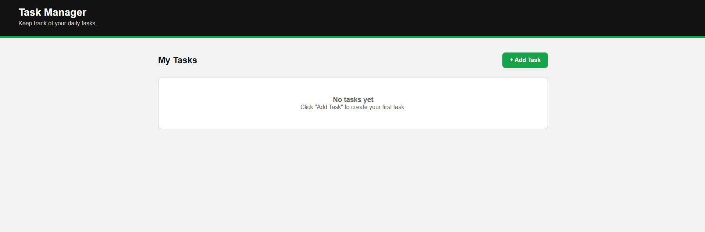
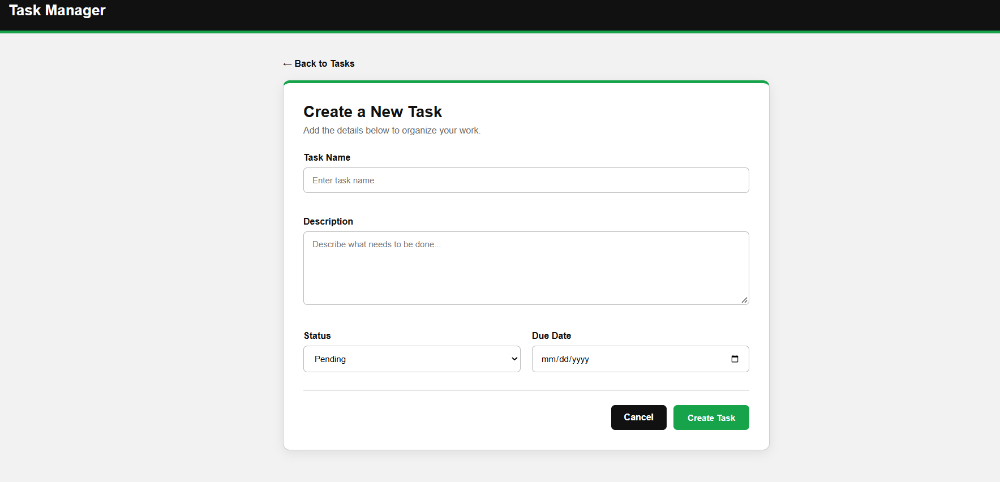
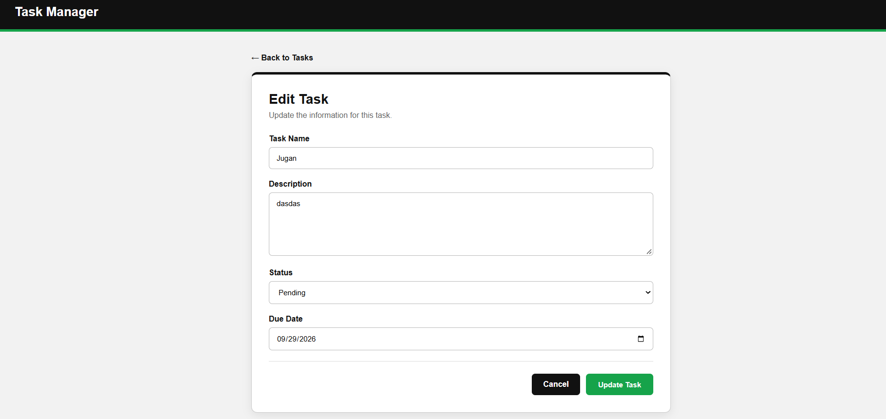
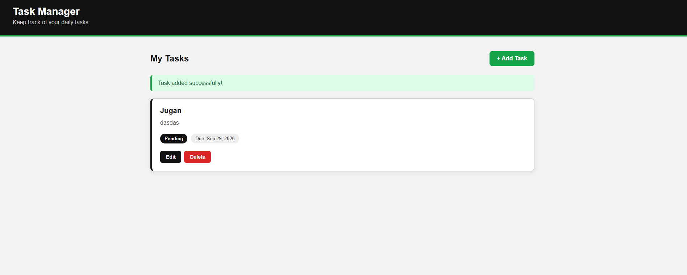

# 📋 Personal Task Manager

**Project Code:** WST21-PM-2026-SF  
**Student Name:** Ranier Jugan Jr.  
**Course & Year:** BSIT 7

---

## 📌 Project Description

The Personal Task Manager is a simple web-based application built using **Laravel, PHP, MySQL, Blade, HTML, and CSS**.

The system allows users to organize and manage their tasks by creating, viewing, editing, and deleting tasks. Users can also update the task status and set a due date.

---

## ✨ Features

- ➕ Add a new task
- 👀 View all tasks
- ✏️ Edit existing tasks
- 🗑️ Delete tasks
- 🔄 Update task status
- 📅 Set a due date
- 📝 Add a task description
- 🎨 Simple and user-friendly interface
- 💾 MySQL database integration

---

## 🛠️ Technologies Used

- **Laravel** – PHP web framework
- **PHP** – Backend programming language
- **MySQL** – Database management system
- **Blade** – Laravel templating engine
- **HTML** – Page structure
- **CSS** – Page styling
- **Composer** – PHP dependency management
- **XAMPP** – Local development environment

---

## 📂 Project Structure

```text
task_manager/
│
├── app/
│   ├── Http/
│   │   └── Controllers/
│   │       └── TaskController.php
│   │
│   └── Models/
│       └── Task.php
│
├── database/
│   └── migrations/
│       └── create_tasks_table.php
│
├── resources/
│   └── views/
│       └── tasks/
│           ├── index.blade.php
│           ├── create.blade.php
│           └── edit.blade.php
│
├── public/
│   └── css/
│       └── style.css
│
├── routes/
│   └── web.php
│
├── screenshots/
│   ├── dashboard.png
│   ├── Create.png
│   ├── Edit.png
│   └── Final.png
│
├── .env
├── artisan
├── composer.json
└── README.md
```

---

## 🗄️ Database

The project uses **MySQL** with a database named:

```text
task_manager
```

### Tasks Table

| Field | Type | Description |
|---|---|---|
| `id` | Big Integer | Unique task ID |
| `task_name` | String | Name of the task |
| `description` | Text | Description of the task |
| `status` | String | Task status |
| `due_date` | Date | Task due date |
| `created_at` | Timestamp | Date the task was created |
| `updated_at` | Timestamp | Date the task was updated |

---

## ⚙️ Installation and Setup

### 1. Clone the Repository

```bash
git clone https://github.com/EmmmFabe/task_manager.git
```

Go into the project folder:

```bash
cd task_manager
```

### 2. Install Dependencies

```bash
composer install
```

### 3. Create the Environment File

```bash
copy .env.example .env
```

### 4. Generate Application Key

```bash
php artisan key:generate
```

### 5. Configure the Database

Open the `.env` file and configure your MySQL database:

```env
DB_CONNECTION=mysql
DB_HOST=127.0.0.1
DB_PORT=3306
DB_DATABASE=task_manager
DB_USERNAME=root
DB_PASSWORD=
```

Change `DB_PASSWORD` if your MySQL installation uses a password.

### 6. Create the Database

Create a MySQL database named:

```text
task_manager
```

This can be done using **phpMyAdmin** or MySQL.

### 7. Run the Migrations

```bash
php artisan migrate
```

If the database already contains the project's tables and the existing data is not needed, use:

```bash
php artisan migrate:fresh
```

### 8. Start the Laravel Server

```bash
php artisan serve
```

Open the application in your browser:

```text
http://127.0.0.1:8000
```

---

## 🔄 How the System Works

The project follows the Laravel MVC structure:

```text
User
  ↓
Route
  ↓
Controller
  ↓
Model
  ↓
Database
  ↓
Controller
  ↓
Blade View
  ↓
User
```

### Routes

The routes are defined in:

```text
routes/web.php
```

They determine which URL handles each task operation.

### Controller

The `TaskController` handles the main task operations:

- Display tasks
- Show the create form
- Store new tasks
- Show the edit form
- Update tasks
- Delete tasks

### Model

The `Task` model represents the `tasks` database table and allows Laravel to interact with the database.

### Blade Views

The Blade files are responsible for displaying the application's interface:

```text
index.blade.php
create.blade.php
edit.blade.php
```

---

## 📸 Screenshots

### Dashboard



### Create Task



### Edit Task



### Final Task Manager



---

## 📝 Task Status

Tasks can have different statuses:

- **Pending**
- **Completed**

This allows users to keep track of tasks that still need to be completed and tasks that have already been finished.

---
